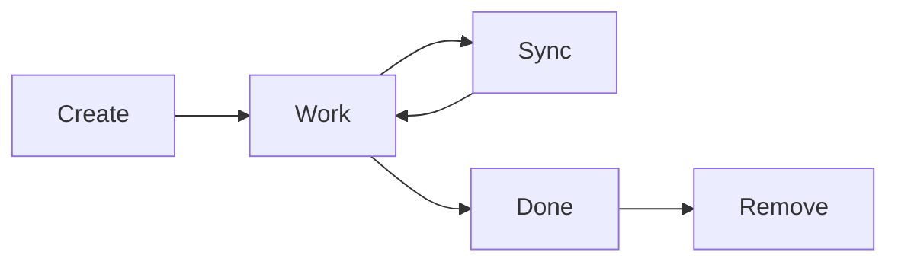
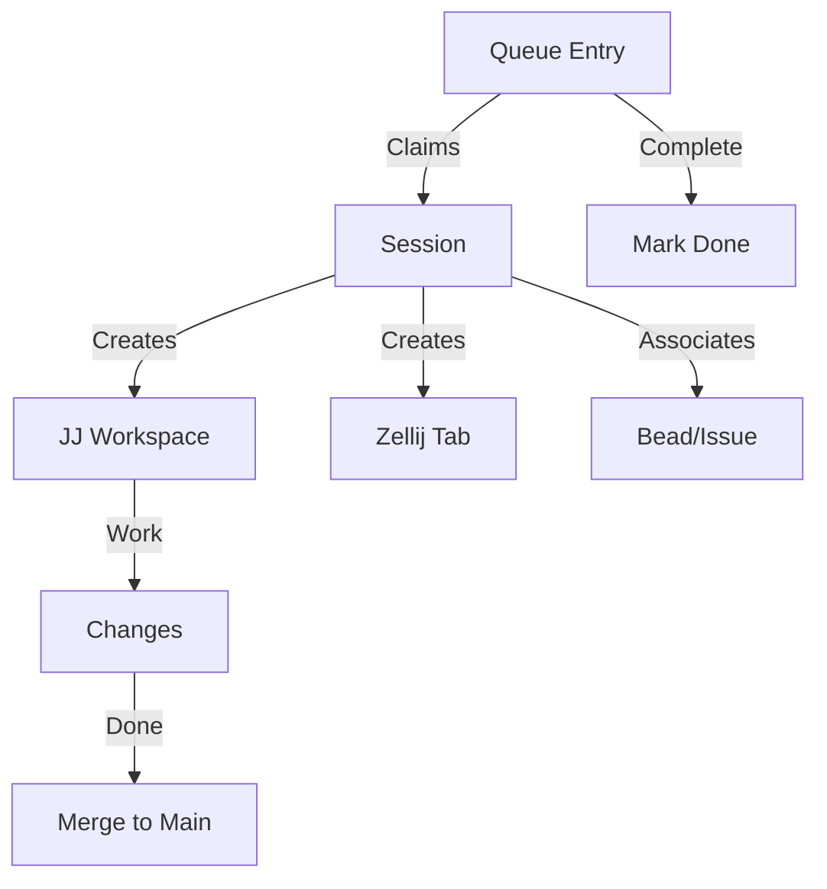

# Core Concepts

Understanding the three core concepts of ZJJ.

---

## The Mental Model

ZJJ has three fundamental concepts that work together:

| Concept | Description | Commands |
|---------|-------------|----------|
| **Session** | Named isolated workspace + optional Zellij tab + optional bead association | `zjj add`, `zjj focus`, `zjj done` |
| **Queue Entry** | Unit of work that workers/agents can claim and process | `zjj queue --add`, `zjj queue worker` |
| **Done** | Complete work and land it back to main | `zjj done` |

---

## Sessions

A **session** represents an isolated piece of work. When you create a session, ZJJ:

1. Creates a new JJ workspace (isolated from main)
2. Creates a Zellij tab for that workspace (optional)
3. Associates it with a bead/issue (optional)
4. Tracks its state in the database

### Session Lifecycle



### Example

```bash
# Create a session
zjj add auth-refactor --bead BD-123

# Work on it
zjj focus auth-refactor
# ... make changes ...

# Keep synced
zjj sync auth-refactor

# Finish
zjj done

# Clean up
zjj remove auth-refactor
```

---

## Queue Entries

A **queue entry** is a work item in the merge/processing queue. Multiple workers (human or AI) can process queue entries in parallel safely.

### Queue Properties

- **Priority** - Higher priority entries processed first
- **Status** - `pending`, `processing`, `completed`, `failed`
- **Lease** - Worker claims entry with time-limited lease
- **Retry** - Failed entries can be retried
- **Stale Reclaim** - Abandoned entries can be reclaimed

### Example

```bash
# Add work to queue
zjj queue --add feature-a --bead BD-101 --priority 3
zjj queue --add feature-b --bead BD-102 --priority 5

# List queue
zjj queue --list

# Process queue (worker)
zjj queue worker --loop
```

---

## Workspaces vs Sessions vs Queue

| Aspect | Workspace | Session | Queue Entry |
|--------|-----------|---------|-------------|
| **What** | JJ workspace (branch) | Workspace + Zellij tab + metadata | Work item in queue |
| **When** | Created automatically with session | Created by `zjj add` | Created by `zjj queue --add` |
| **Purpose** | Isolation | User interface to workspace | Coordination |
| **Lifecycle** | Managed by JJ | Managed by ZJJ | Managed by queue |

---

## Integration

How these concepts work together:



**Flow:**
1. Queue entry exists for work
2. Worker claims entry, creates session
3. Session creates workspace + tab
4. Work happens in isolation
5. Changes merged to main
6. Entry marked complete

---

## Next Steps

- **[User Guide - Workspaces](./guide/workspaces.md)** - Detailed workspace management
- **[User Guide - Queue](./guide/queue.md)** - Queue coordination
- **[User Guide - Beads](./guide/beads.md)** - Issue tracking integration
